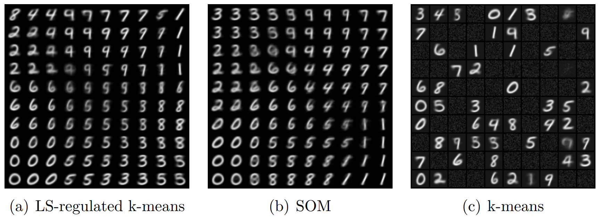

# Laplacian-based-lateral-interaction
Reproduction of paper "Lateral interaction by Lapalcian-based graph smoothing for deep neural networks" ([https://doi.org/10.1049/cit2.12265](https://doi.org/10.1049/cit2.12265))
The experiment show that lateral interaction implemented by SOM model is a special case of LS-regulated k-means, and they both show the topology-preserving capability.


### Running:
- Prepare
```bash
git clone https://github.com/alexxchen/Laplacian-based-lateral-interaction.git
cd Laplacian-based-lateral-interaction
python -m venv venv
source venv/bin/activate
pip install -r requirement.txt
```
- Training
```bash
python monitor.py
```
